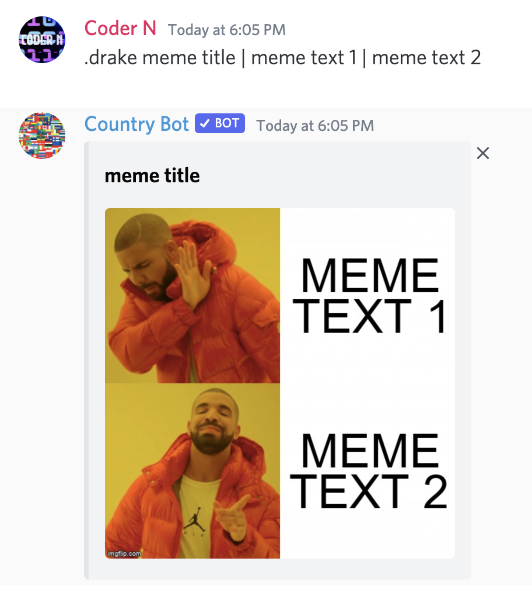

# drake

## Usage

```text
.drake meme title | meme text 1 | meme text 2
```

If you use this command correctly the resulting image should look like this:



Example Usage:

`.drake Very True | Country Bot is bad | Country Bot is good`

To get information on this command in discord, use:

`.help drake`

